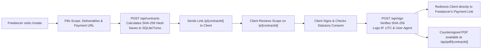

# PayBeforeWork

> **Open-Source Upfront Milestone Agreement & Deposit Lock Tool for Freelancers**

Never start client work without a deposit again. PayBeforeWork empowers solo developers, designers, and freelancers to generate an airtight, plain-English milestone contract, lock in an upfront deposit (default 50%), delimit scope boundaries, and capture legally binding e-signatures—without middleman fees, escrow holds, or vendor lock-in.

---

## Why PayBeforeWork

Freelancers lose thousands of dollars each year to **scope creep**, **delayed kickoff deposits**, and **payment default**. Traditional freelance platforms charge 10–20% platform cuts, while boilerplate legal contracts are dense, unreadable, and routinely ignored.

**PayBeforeWork replaces bureaucratic contracts with an enforceable 1-link proposal:**
- **Zero Platform Fees:** 100% of your billed rate goes directly to your bank account or Stripe account.
- **Non-Custodial Architecture:** PayBeforeWork never touches, holds, or intermediates funds. Payments flow directly to the freelancer's designated payment gateway.
- **Enforceable Scope Defense:** Automatic work-stoppage terms and clear out-of-scope hourly fallbacks protect your working hours.
- **Cryptographic Non-Repudiation:** Tamper-evident SHA-256 document hashing paired with ESIGN / eIDAS audit logging.

---

## Core Features

### 1. Mandatory Upfront Deposit Clearance (Condition Precedent)
- Contracts incorporate **Section 3.1: Condition Precedent to Performance & Deposit Clearance**.
- Freelancer delivery deadlines and work obligations are legally tolled and do not commence until the upfront deposit (configurable: 30%, 50%, 70%, 100%) has cleared into the contractor's account.

### 2. Scope Locking & Exhaustive Deliverables
- Define an itemized checklist of deliverables (e.g. 3 milestone deliverables).
- Work product is explicitly delimited—anything not enumerated in the checklist is contractually classified as **Out-of-Scope**.

### 3. Out-of-Scope Hourly Fallback & Work Stoppage
- Incorporates **Section 4.2: Scope Delimitation, Revision Thresholds & Automatic Stop-Work**.
- Revisions are capped (default: 2 rounds within 5 business days).
- When a client requests changes outside the agreed checklist, work automatically halts without delay liability until an out-of-scope change order is authorized at the agreed hourly rate (€/$/£).

### 4. Intellectual Property (IP) Retention Clause
- Incorporates **Section 8.1: Reservation of Rights & Conditional IP Assignment**.
- All code, design assets, and deliverables remain the exclusive property of the freelancer.
- Legal transfer of copyright occurs strictly and conditionally upon 100% full and final payment clearance.

### 5. Tamper-Evident Cryptographic Audit Trail
- Incorporates **Section 14.9: Electronic Execution & Cryptographic Verification Assent**.
- Generates a canonical SHA-256 hash of all contractual terms upon creation.
- On client execution (`/api/sign`), the server re-verifies the SHA-256 hash, captures the signatory's legal name, corporate email, IP address, device User-Agent, and ISO 8601 UTC timestamp.
- Produces a downloadable, 2-page countersigned PDF via PDFKit (`/api/pdf/[contractId]`) embedding the complete cryptographic audit trail.

---

## Architecture & Tech Stack

```
paybeforework/
├── app/
│   ├── api/
│   │   ├── contracts/            # POST create contract, GET contract by ID
│   │   ├── sign/                 # POST verify terms hash & record audit log
│   │   └── pdf/[contractId]/     # GET stream countersigned 2-page PDF
│   ├── create/                   # Interactive contract generator with live preview
│   ├── p/[contractId]/           # Client-facing proposal & e-signing view
│   │   └── success/              # Post-signature receipt, audit recap & PDF export
│   ├── terms/                    # Platform Terms of Service & non-custodial disclosure
│   ├── privacy/                  # GDPR Art. 6(1)(b)/(f) privacy & data protection policy
│   ├── page.tsx                  # Marketing homepage with interactive contract presets
│   └── layout.tsx                # Global layout, header navigation & legal footer
├── db/
│   ├── schema.ts                 # Drizzle SQLite schema: `contracts` & `audit_logs`
│   └── client.ts                 # LibSQL / SQLite client with self-healing table init
├── lib/
│   ├── hash.ts                   # Canonical SHA-256 term hashing & timing-safe verification
│   ├── legal.ts                  # Statutory boilerplate clauses & platform role disclaimers
│   ├── pdf.ts                    # PDFKit generator for formal 2-page execution documents
│   └── validations.ts            # Zod schemas for input validation & currency boundaries
├── drizzle.config.ts             # Drizzle Kit migration & introspect configuration
└── public/                       # Static public assets
```

### Technology Highlights:
- **Framework:** [Next.js 15](https://nextjs.org/) (App Router, Server Components & Route Handlers)
- **Language & Runtime:** [TypeScript](https://www.typescriptlang.org/) & Node.js
- **Styling:** [Tailwind CSS](https://tailwindcss.com/) with `@tailwindcss/postcss`
- **Database & ORM:** [Drizzle ORM](https://orm.drizzle.team/) with [`@libsql/client`](https://github.com/tursodatabase/libsql-client-ts) (supports local `file:local.db` or cloud [Turso](https://turso.tech/))
- **Document Generation:** [PDFKit](https://pdfkit.org/) for programmatic binary PDF generation
- **Validation:** [Zod](https://zod.dev/) for strict API payload and form validation
- **Identification:** [Nanoid](https://github.com/ai/nanoid) for collision-resistant 12-char contract IDs

---

## Application Routes & User Flow



| Route | Type | Description |
|---|---|---|
| `/` | Page (Static) | Conversion homepage with interactive project presets & value propositions |
| `/create` | Page (Client) | 4-step contract generator with dynamic, real-time client preview |
| `/p/[contractId]` | Page (Dynamic) | Read-only client proposal with mandatory consent checkbox and sign action |
| `/p/[contractId]/success` | Page (Dynamic) | Ratification confirmation page with audit log details & direct payment button |
| `/terms` | Page (Static) | Terms of Service outlining non-custodial status and liability disclaimers |
| `/privacy` | Page (Static) | GDPR Article 6 & eIDAS/ESIGN privacy compliance specification |
| `POST /api/contracts` | API Endpoint | Validates contract fields, computes canonical SHA-256 hash, inserts into DB |
| `GET /api/contracts/[id]`| API Endpoint | Fetches contract JSON payload with parsed deliverables array |
| `POST /api/sign` | API Endpoint | Cryptographically checks hash, logs audit record, sets status to `signed` |
| `GET /api/pdf/[id]` | API Endpoint | Generates and streams production-grade 2-page countersigned PDF |

---

## Local Setup

### Prerequisites
- **Node.js:** v18.18.0 or higher (v20+ recommended)
- **npm**, **yarn**, or **pnpm**

### 1. Clone the Repository
```bash
git clone https://github.com/x7ssss/paybeforework.git
cd paybeforework
```

### 2. Install Dependencies
```bash
npm install
```

### 3. Configure Environment Variables
Copy or create a `.env.local` file in the root directory:

```bash
# Option A: Local SQLite database (Zero setup, runs out of the box)
DATABASE_URL="file:local.db"

# Option B: Turso / Remote libSQL database (Optional for cloud production)
# DATABASE_URL="libsql://your-database-name.turso.io"
# DATABASE_AUTH_TOKEN="your-turso-jwt-token"
```

> **Note:** The application includes a self-healing initialization mechanism in `db/client.ts`. If running on SQLite `file:local.db`, missing tables (`contracts` and `audit_logs`) will be automatically created upon the first request.

### 4. Push Database Schema (Optional)
If you wish to manage migrations via Drizzle Kit:
```bash
npm run db:push
```

### 5. Start the Development Server
```bash
npm run dev
```

Open [http://localhost:3000](http://localhost:3000) in your browser.

### 6. Production Build & Verification
To verify TypeScript types and build the optimized production bundle:
```bash
npm run build
npm run start
```

---

## Legal & Regulatory Disclaimer

**PayBeforeWork provides software generation and electronic signature infrastructure only.**
- PayBeforeWork is **not** a law firm, does not offer legal advice, and does not establish an attorney-client relationship.
- PayBeforeWork is **not** an escrow agent, payment processor, money transmitter, or money services business (MSB).
- All funds, upfront milestone deposits, and final invoices are remitted directly from the client to the contractor via external payment rails (e.g., Stripe, direct wire, ACH/SEPA).
- Electronic signatures generated via PayBeforeWork are structured to satisfy Simple Electronic Signature standards under the **US ESIGN Act (15 U.S.C. § 7001)**, the **Uniform Electronic Transactions Act (UETA)**, and **EU Regulation No 910/2014 (eIDAS)**. Users should consult qualified legal counsel in their respective jurisdiction for specific legal requirements.

---

## License

MIT © [x7sss](https://github.com/x7ssss)
